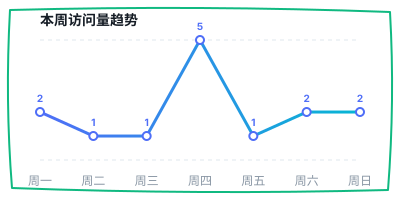

# 北航生医工 / 医工交叉“择导”利器



> **非官方项目 | 开源公益 | 信息聚合** 面向北京航空航天大学生物与医学工程学院、医学科学与工程学院相关导师与师资信息查询的静态前端项目。项目聚焦“公开可核验”的择导辅助：优先整理学院官网、北航教师主页等公开来源，并在不引入主观排名的前提下，提供检索、方向筛选、资料完整度提示和轻量决策辅助。

[在线系统](https://donaldjoker2025-arch.github.io/my-buaa-app/)

## 项目目标

本项目不替代学院官网、当年招生目录或导师本人确认，目标是把分散的公开页面整理成一个更适合前期缩小范围的工作台：

* 先按学院、方向、关键词快速缩小候选范围
* 再按主页、邮箱、招生线索和资料完整度继续核验
* 最后回到官网和导师主页完成正式确认

## 功能概览

### 导师索引

* 工作台式首页，展示导师/师资记录、方向索引、公开邮箱和招生线索概况
* 支持按姓名、学院、方向分类、邮箱和关键词检索
* 每位导师提供方向标签、联系方式状态、硕导/博导标签、资料完整度和来源入口

### 匹配测试（v0.2.0 内测版）

* 首创 BMETI 生医工科研性格测验，通过纯正“黑话”测验计算科研八字
* 将导师的官方标签与用户测试结果进行 28 种专业分类（如“人工智能×空天医学”）下的模糊相似度匹配
* 推荐 6 位天选导师（SSR/SR/S/A 分级），拒绝同质化推荐，探索跨学科组合
* 本地持久化缓存测试结果，防止进度丢失

### 择导实验室

* 支持基于 `topicTags` 和官方方向词做兴趣画像
* 提供“只看有公开邮箱 / 优先招生线索 / 优先资料完整”等偏好开关
* 输出 `高度相关 / 可继续看 / 信息待补` 三档候选，不做绝对分数排名
* 支持最多 4 位导师横向对比，并按“可立即联系 / 建议先看主页 / 建议先补证据”分组下一步动作
* 支持本地待联系清单，便于多次访问时继续筛选

### 培养方向与来源核验

* 保留生物力学、生物医学材料、细胞与组织工程等官方方向入口
* 汇总学院官网、教师主页、招生通知等来源链接
* 提供联系导师前的核验清单和基础建议

### 社区补充

* 支持在浏览器本地暂存“待审核”的学生补充信息
* 仅 `src/communityNotes.js` 中人工审核后的条目会真正展示

## 数据来源

项目当前依赖以下公开页面：

* 北京航空航天大学生物与医学工程学院：硕士研究生培养方向设置及指导教师对照表
* 北京航空航天大学生物与医学工程学院：师资队伍页面
* 北京航空航天大学生物与医学工程学院：医工交叉学科群 2026 年博士生招生资格导师名单
* 北京航空航天大学医学科学与工程学院：人员列表
* 北京航空航天大学医学科学与工程学院：师资人员详细索引
* 北京航空航天大学医学科学与工程学院：医工交叉学科群 2026 年博士研究生招生工作方案
* 北京航空航天大学教师主页系统：生物与医学工程学院、医学院教师列表及教师索引

## 技术栈

* React 19
* Vite
* ESLint
* GitHub Pages

## 项目结构

```text
.
├─ src/
│  ├─ App.jsx                  # 主页面与核心交互逻辑
│  ├─ index.css                # 全局样式
│  ├─ supervisorDetails.js     # 自动生成的导师详情数据
│  └─ communityNotes.js        # 已审核社区补充
├─ scripts/
│  ├─ generate-supervisor-details.mjs
│  ├─ audit-supervisor-directions.mjs
│  ├─ supervisor-manual-overrides.js
│  └─ deploy-gh-pages.mjs
├─ public/
└─ vite.config.js
```

## 本地开发

### 环境要求

* Node.js 18+
* npm 9+

### 安装依赖

```bash
npm install
```

### 启动开发环境

```bash
npm run dev
```

### 构建生产包

```bash
npm run build
```

### 代码检查

```bash
npm run lint
```

## 常用脚本

* `npm run dev`：启动本地开发服务器
* `npm run build`：构建生产版本
* `npm run preview`：本地预览构建结果
* `npm run lint`：运行 ESLint
* `npm run generate:details`：重新抓取并生成 `src/supervisorDetails.js`
* `npm run audit:directions`：审查方向与导师索引的一致性
* `npm run deploy:release -- <版本号>`：手动发布一个带版本号的 GitHub Pages 归档版本
* `npm run deploy:stable`：手动更新稳定版线上入口

## 数据维护约定

### 详情数据

运行：

```bash
npm run generate:details
```

会从公开官网页面、北航教师主页系统和本地缓存重新生成 `src/supervisorDetails.js`，用于补充：

* 个人主页入口
* 公开邮箱
* 硕导 / 博导标签
* 科研摘要
* 招生线索

对于无法安全自动匹配到教师主页的姓名，可在 `scripts/supervisor-manual-overrides.js` 中补充最小必要的公开来源字段，例如 `officialUrl`、`teacherHomeUrl`、`title`、`email` 与导师资格标签。

### 社区补充审核

* 前端用户提交的信息只会保存在浏览器本地，不会自动进入仓库
* 只有人工审核后，才应将可信内容写入 `src/communityNotes.js`
* 社区补充不参与自动匹配排序，只作为补充展示信息

## 发布、版本管理与回退

当前发布采用“双轨”方式，既保证日常更新自动化，也保留可回退的归档版本：

* 稳定版地址：`https://donaldjoker2025-arch.github.io/my-buaa-app/`
* 历史归档地址：`https://donaldjoker2025-arch.github.io/my-buaa-app/releases/<版本号>/`

### 自动化发布规则

仓库已配置 GitHub Actions 工作流：

* `push main`：自动构建并更新稳定版站点
* `push release-* tag`：自动构建并发布一个归档版

也就是说，日常改动只需要：

```bash
git push origin main
```

稳定版网页就会自动更新，不需要再手动执行 deploy 脚本。

### 推荐发布流程

如果某一版你希望长期保留归档，推荐这样做：

```bash
git tag release-v0.2.0
git push origin release-v0.2.0
```

推送这个 tag 后，GitHub Actions 会自动把这一版发布到：

```text
https://donaldjoker2025-arch.github.io/my-buaa-app/releases/release-v0.2.0/
```

### 手动发布作为兜底

如果 GitHub Actions 暂时不可用，仍然可以手动执行：

```bash
npm run deploy:stable
npm run deploy:release -- 2026-06-10-lab-v1
```

### 为什么这样做

* `deploy:release` 会把构建产物发布到 `gh-pages` 分支下的 `releases/<版本号>/`
* `deploy:stable` 只更新稳定版根路径，同时保留历史归档目录
* `main` 仍然只保存源码，网页展示内容通过自动构建同步到 GitHub Pages
* 出现问题时，可以切回旧 tag 或旧提交后重新 push / deploy 完成回退

### 回退建议

如果稳定版出现问题，建议按以下方式处理：

1. 定位上一个可用 tag 或提交
2. 切回对应代码状态
3. 重新推送到 `main`，或手动执行 `npm run deploy:stable`

这样可以在不删除历史归档的前提下恢复线上稳定版本。

## 维护原则

* 优先展示公开可核验信息，不补充无法直接确认的主观评价
* 不做导师“强排名”，只做信息组织和轻量决策辅助
* 同名教师、跨学院任职、兼职导师等情况必须保守处理
* 招生资格、名额、方向变化等信息以当年学院通知为准

## 💖 赞助与支持

本项目由个人开发者独立维护。如果你觉得这个项目在择导过程中帮助到了你，欢迎请作者喝杯咖啡 ☕️，这将是我持续更新的最大动力！

<div align="center">
  
  
</div>

## 免责声明

学院官网页面可能迁移，同名教师、跨学院任职、兼职导师等情况也可能导致旧资料失效。页面中未由公开来源直接确认的信息不应展示，最终请始终以学院官网、北航教师个人主页和当年招生通知为准。
